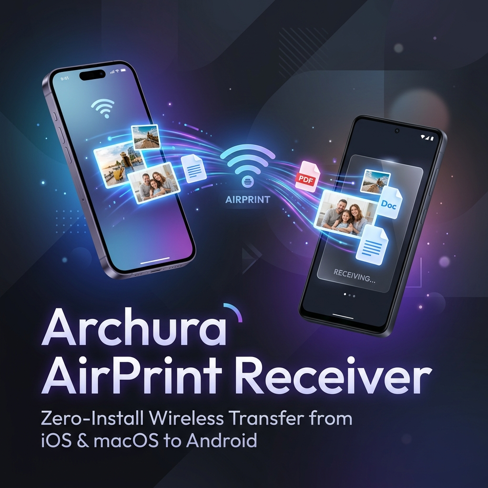
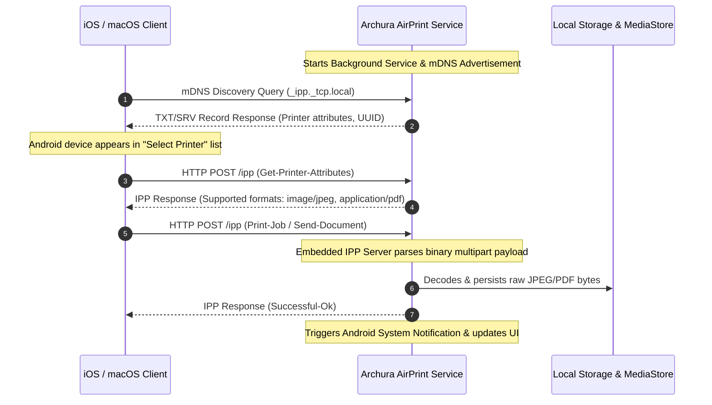

<p align="center">
  
</p>

# 🖨️ Archura AirPrint Receiver for Android — Zero-Install Wireless Print & Document Transfer

[](https://kotlinlang.org/)
[-green.svg?style=flat-square&logo=android)](https://developer.android.com/)
[](https://developer.android.com/jetpack/compose)
[](#-architecture-layout)
[](https://detekt.dev/)
[](LICENSE)

An extremely lightweight, secure, and local-first Android application that turns your Android device into a wireless **AirPrint Receiver** (and **AirPrint Reciever**). This allows you to transfer photos, documents, and PDFs from any iOS device (iPhone, iPad) or macOS device directly to your Android device via Apple's native print menu—**without installing any companion app on the Apple side!**

By leveraging native printing protocols, this app functions as a zero-configuration, seamless **Apple AirDrop alternative** for local cross-platform file sharing.

---

## 🌟 Key Features

- **Zero-Install Apple Side:** No client app, profile, or configuration needed on iOS/macOS. Simply tap "Print" in any Apple app (Photos, Safari, Files, Notes, etc.) and select your Android device.
- **mDNS / DNS-SD Service Advertisement:** Advertises the `_ipp._tcp` printer service with appropriate subtypes (`_universal._sub._ipp._tcp.local`) for automatic iOS/macOS device discovery.
- **Embedded IPP Server:** Fully lightweight HTTP/IPP server running locally on Android to parse printer attributes and handle binary print jobs natively.
- **Multi-Format Receipt:** High-speed persistence of received JPEGs, PNGs, and PDFs to secure, app-owned storage.
- **Interactive Document Operations:** Clean Compose UI to preview received files, perform rotation, crop JPEGs, and export directly to the Android System Gallery via MediaStore.
- **Modern Jetpack Compose UI:** Designed with strict adherence to **Clean Architecture** and **MVVM** pattern, featuring a gorgeous dark mode interface and responsive user elements.

---

## 📸 User Interface Preview

<p align="center">
  
</p>

---

## 🔄 Protocol Workflow

The application achieves zero-install document transfer by mimicking an enterprise-grade AirPrint printer. The network sequence operates as follows:



---

## 📁 Project Layout

The codebase strictly follows the **Nexus-APCP public/private boundary** layout to ensure optimal modularity and code maintenance:

| Directory/File Path | Purpose |
| :--- | :--- |
| **`app/src/main/kotlin/com/archura/airprint/ui`** | Compose screens, custom components, styling, navigation, and ViewModels. |
| **`app/src/main/kotlin/com/archura/airprint/domain`** | Pure domain objects, entities, repository interfaces, and core business use cases. |
| **`app/src/main/kotlin/com/archura/airprint/data`** | Local data sources, storage services, repository implementations, and entity mappers. |
| **`app/src/main/kotlin/com/archura/airprint/infrastructure`** | Low-level network responders, mDNS advertisements, IPP socket parser, and format decoders. |
| **`docs/`** | Technical deep dives including architecture, IPP protocol detail, setup, and troubleshooting. |
| **`scripts/`** | Repository maintenance and rapid local environment setup tools. |

---

## 🛠️ Development & Build Setup

### System Requirements
- **JDK 17** or newer
- **Android SDK 26** (Android 8.0 Oreo) or newer
- **Gradle 8.2+** (configured in gradle wrapper)

### Checkpoint Operations
To ensure all public and private API boundaries are perfectly intact during active development, utilize the provided script:

```powershell
powershell -ExecutionPolicy Bypass -File scripts/checkpoint.ps1
```

### Direct Gradle Execution
Run standard unit tests, detekt code style checkers, and linters using:

```powershell
.\gradlew.bat testDebugUnitTest lint detekt
```

---

## 🛡️ License

This project is licensed under the MIT License - see the [LICENSE](LICENSE) file for details.

Developed with 💜 by **Aybars Barut** and the **Archura** team.
