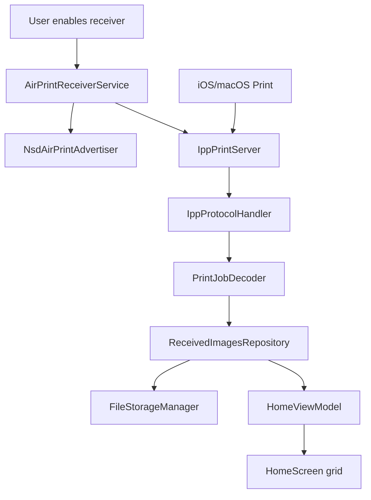

# Architecture

## Layers

| Layer | Responsibility |
| :--- | :--- |
| UI | Compose screens, screen state, user actions |
| Domain | Models, repository contracts, use cases |
| Data | Repository implementations and app-owned file storage |
| Infrastructure | AirPrint service lifecycle, mDNS advertisement, IPP handling |

## Receive Flow

## Initial Constraints

- Local network only.
- Single process Android app.
- One embedded IPP listener.
- App-owned storage, no external database.
- Hilt for dependency injection.
